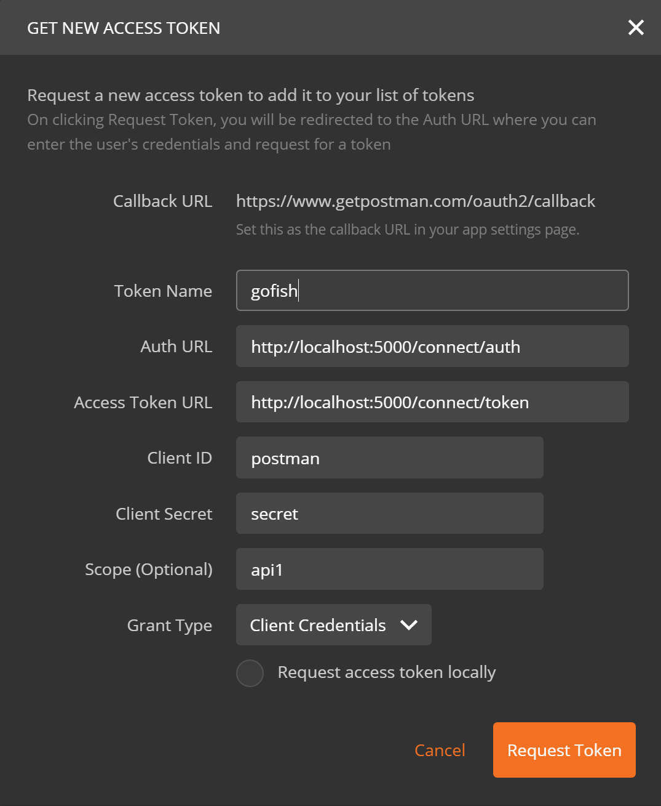

# Go Fish

Seafood Marketing Application.

## Summary

A web-application giving fishermen and fish merchants easy access to a market of buyers including:

- Individuals
- The wholesale market
- Restaurants

The live version of the API is published on an AWS EC2 Instance.  See the API reference below for API usage scenarios.

- [Advert Api](http://54.171.92.206:5001/api/ "API URL")
- [Inventory Api](http://54.171.92.206:5002/api/ "API URL")

A set of prototype MVC web-based user-interfaces which use the services are also published to AWS and the entry point is at [this AWS location](http://54.171.92.206:5003 "Live User Interface")

If you want to try it out, use the test user accounts of "nina" or "fred".  The passwords are the same as the user name

## Technology stack

- MS .NET Core 1.0.1 + WebApi + MVC (C#)
- EF Core 1.0.1 + Migrations
- Sqlite DB
- RabbitMQ
- Docker & Docker-Compose
- Vagrant & VirtualBox
- Ubuntu
- IdentityServer4
- EventStore
- Amazon Web Services

## Developer Setup options

### Prerequisites

To get up and running, ideally you will need the following prerequisites on your machine.

- VirtualBox
- Vagrant
- Bower

### Process

1. Ensure the above prerequisites are installed.

1. Clone the repo

    `git clone https://github.com/jakimber/GoFish`

1. Publish the application components:

    If you are using a shell like Git-Bash you can simply run this in the root of the GoFish project:

    ```ssh
    ./build.sh
    ```

    If you are using a command line that doesn't like shell scripts, open the `build.sh` file and run each of the lines containing the following instructions:

    - Bower installations in the roots of all MVC projects.
    - dotnet restore, dotnet build and dotnet publish for each .NET application.

1. Create the server:

    If you haven't installed it already:
        `vagrant plugin install vagrant-docker-compose`

    and then: `vagrant up` in the root of the GoFish project.

    This configures a virtual machine with:

    - Ubuntu OS
    - RabbitMQ instance
    - Docker
    - Docker Compose

    It also then runs the Docker-Compose file for the application and gets the application components running.

1. You will need to configure a new user in the [RabbitMQ instance](http://localhost:15672 "Local Rabbit MQ User Interface") to match the one that is currently hard-coded in the service code that uses it.

    To access the RabbitMQ instance log in using the default:

        `Username: guest, Password: guest`

    Select `Admin`, `Users`, `Add a User`.  Add the gofish user:

        `Username: gofish, Password: gofish`

    Ensure the user has access permissions by selecting it once created and clicking the `Set Permissions` button.

1. You should now be able to use your browser to access the website at [this location](http://localhost:5005 "Locally published Web UI")

1. You can use and debug the Api at the following locations with Postman:

    `http://localhost:5001` - Adverts

    `http://localhost:5002` - Inventory

    using the following settings in the authentication helper:



---

## Architecture

|GoFish.Advert|GoFish.Inventory|GoFish.Shopfront|
|:-:|:-:|:-:|
|_Advertise and Add Stock_|_List and Manage Stock_|_Browse Stock, User Profile, Reviews_|
|| _WebApi services containing context logic_
||||
||**Docker**|
|| _Hosts the above services_
||||
||**RabbitMQ**|
|| _Communicate between services_
||||
||**Ubuntu running on VirtualBox**|
|| _Docker for windows doesn't work on Windows 10 Home_
||||
||**Windows 10 Home**|
|| _Development box OS_
|

Notes:

1. Each service has it's own read-model datastore (currently Sqlite in all of them)
1. The Advert service's Events are also published to an EventStore instance to allow for event-sourcing

---

## Phase 1 roadmap

1. Ensure WebApi conforms to appropriate RMM level to enable easy hypermedia navigation
1. Create SPA web-based UI (ReactJs or Angular2)
1. Create a native app for iOS, Android, Windows Phone (Xamarin)
1. Create suite of unit tests for the services
1. The shopfront service will probably need splitting into smaller services

## Phase 2 feature list

- Reserving stock
- Buying stock
- Purchase Orders / Invoicing
- Payment Processing
- Shipping & Logistics
- Merchants - Fishermen sell to merchants who then communicate with punters on their behalf

---

## API reference

_Note_  You will need to obtain a _bearer token_ from the live instance to use this API in that environment.
Follow the Postman diagram above, exchanging the AuthUrl and AccessTokenUrl for the live instance Urls.

- PUT /api/adverts/{id} - creates a new draft advert if it doesn't exist otherwise updates an advert (status=created)
- PUT /api/postedadverts/{id} - posts (submits) an advert
- PUT /api/publishedadverts/{id} - publishes an advert (mq does this automatically)
- GET /api/adverts - gets draft adverts
- GET /api/adverts/{id} - gets an existing advert
- GET /api/postedadverts - lists all adverts in "posted" state
- GET /api/publishedadverts - lists all adverts in "published" state
- GET /api/withdrawnadverts - lists all adverts in "withdrawn" state
- GET /api/postedadverts/{id} -- gets a posted advert
- GET /api/publishedadverts/{id} -- gets a published advert
- GET /api/adverts?status=active - created, posted, published
- GET /api/adverts?status=inactive - withdrawn, fulfilled
- DELETE / api/adverts/{id} - sets advert 1 status to withdrawn / fulfilled

---

## Configuration options

The repository allows for al local instance to get up and running in Docker on a Vagrant box.
If you want to develop locally, you will need to change the configuration accordingly.
The options are all contained in the following config locations (with comments indicating the right config to use)

- GoFish.Advert: ApplicationSettings.json
- GoFish.UI.MVC: ApplicationSettings.json
- GoFish.Advert.Receiver/ApiProxy (in 2 places)
- GoFish.Inventory.Receiver:  ApiProxy (in 2 places)

Also the program.cs files in any of the components that you intend to run/debug locally will need the UseUrls() changed.
